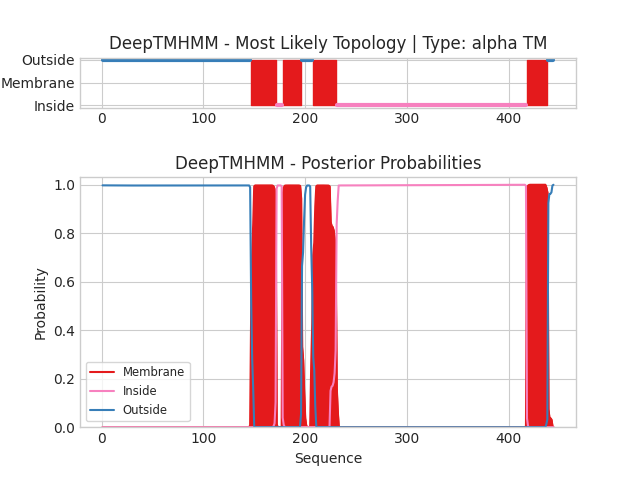

## DeepTMHMM - Predictions
Predicted topologies can be downloaded in [.gff3 format](TMRs.gff3) and [.3line format](predicted_topologies.3line)

You can download the probabilities used to generate this plot [here](Unnamed_probs.csv)
### Predicted Topologies
```
>Unnamed | TM
MRWNKSEYGGVEDIRIPPAKLWKPDVLMYNSADEAFDGTYPTNVVVSHTGSCTYIPPGIFKSTCKIDITWFPFDDQDCEMKFGSWTYNGFKLDLQTQNDEGVTSTYVLNGEWALLGVPGKRNEVFYDCCPEPYLDVTFVIKIRRRTLYYFFNLIVPCVLIASMAVLGFTLPPDSGEKLSLGVTIMLSITIFATIVGEMLPVSDATPLIGTYFNCIMFMVASSVVTTIMILNYHHRLADTHEMPNWVRCVFLQWIPWVLRMGRPGEKITRKTILMQNKMKELDLKERSSKSLLANVLDMDDDFRPASTLPHIHPHHPSHSLAGGSGTGSTANSSTKSGFRVTPGLHQPPPPPPPPPLGNSTGDVTLGDGMTSGIPPGIHRELSLILKEIRVITDKIREDEDTAAIENDWKFAAMVLDRLCLITFTMFTIIATVAVLFSAPHIIVT
OOOOOOOOOOOOOOOOOOOOOOOOOOOOOOOOOOOOOOOOOOOOOOOOOOOOOOOOOOOOOOOOOOOOOOOOOOOOOOOOOOOOOOOOOOOOOOOOOOOOOOOOOOOOOOOOOOOOOOOOOOOOOOOOOOOOOOOOOOOOOOOOOOMMMMMMMMMMMMMMMMMMMMMMMMMIIIIIIMMMMMMMMMMMMMMMMMMMOOOOOOOOOOOMMMMMMMMMMMMMMMMMMMMMMMIIIIIIIIIIIIIIIIIIIIIIIIIIIIIIIIIIIIIIIIIIIIIIIIIIIIIIIIIIIIIIIIIIIIIIIIIIIIIIIIIIIIIIIIIIIIIIIIIIIIIIIIIIIIIIIIIIIIIIIIIIIIIIIIIIIIIIIIIIIIIIIIIIIIIIIIIIIIIIIIIIIIIIIIIIIIIIIIIIIIIIIIIIIMMMMMMMMMMMMMMMMMMMMMOOOOOO

```


```
##gff-version 3
# Unnamed Length: 444
# Unnamed Number of predicted TMRs: 4
Unnamed	outside	1	146				
Unnamed	TMhelix	147	171				
Unnamed	inside	172	177				
Unnamed	TMhelix	178	196				
Unnamed	outside	197	207				
Unnamed	TMhelix	208	230				
Unnamed	inside	231	417				
Unnamed	TMhelix	418	438				
Unnamed	outside	439	444				

```
