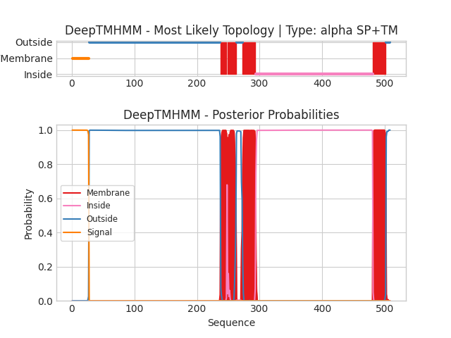

## DeepTMHMM - Predictions
Predicted topologies can be downloaded in [.gff3 format](TMRs.gff3) and [.3line format](predicted_topologies.3line)

You can download the probabilities used to generate this plot [here](uvic.3229.19.p1_probs.csv)
### Predicted Topologies
```
>uvic.3229.19.p1 | SP+TM
MRNIDLSCWSCYLLFFLSTTLPISVYGGPHERRLLNDLLAIYNNLERPVFNESEPLKLSFGLTLQQIIDVDEKNQLLTTNVWLNLQWEDVNMRWNKSEYGGVEDIRIPPAKLWKPDVLMYNSADEAFDGTYPTNVVVSHTGSCTYIPPGIFKSTCKIDITWFPFDDQDCEMKFGSWTYNGFKLDLQTQNDEGVTSTYVLNGEWALLGVPGKRNEVFYDCCPEPYLDVTFVIKIRRRTLYYFFNLIVPCVLIASMAVLGFTLPPDSGEKLSLGTYFNCIMFMVASSVVTTIMILNYHHRLADTHEMPNWVRCVFLQWIPWVLRMGRPGEKITRKTILMQNKMKELDLKERSSKSLLANVLDMDDDFRPASTLPHIHPHHPSHSLAGGSGTGSTANSSTKSGFRVTPGLHQPPPPPPPPPLGNSTGDVTLGDGMTSGIPPGIHRELSLILKEIRVITDKIREDEDTAAIENDWKFAAMVLDRLCLITFTMFTIIATVAVLFSAPHIIVT*
SSSSSSSSSSSSSSSSSSSSSSSSSSSOOOOOOOOOOOOOOOOOOOOOOOOOOOOOOOOOOOOOOOOOOOOOOOOOOOOOOOOOOOOOOOOOOOOOOOOOOOOOOOOOOOOOOOOOOOOOOOOOOOOOOOOOOOOOOOOOOOOOOOOOOOOOOOOOOOOOOOOOOOOOOOOOOOOOOOOOOOOOOOOOOOOOOOOOOOOOOOOOOOOOOOOOOOOOOOOOOOOOOOOOOOOOOOOOOMMMMMMMMMMIMMMMMMMMMMMMMMOOOOOOOOOOMMMMMMMMMMMMMMMMMMMMMIIIIIIIIIIIIIIIIIIIIIIIIIIIIIIIIIIIIIIIIIIIIIIIIIIIIIIIIIIIIIIIIIIIIIIIIIIIIIIIIIIIIIIIIIIIIIIIIIIIIIIIIIIIIIIIIIIIIIIIIIIIIIIIIIIIIIIIIIIIIIIIIIIIIIIIIIIIIIIIIIIIIIIIIIIIIIIIIIIIIIIIIIIIMMMMMMMMMMMMMMMMMMMMMOOOOOOO

```


```
##gff-version 3
# uvic.3229.19.p1 Length: 508
# uvic.3229.19.p1 Number of predicted TMRs: 4
uvic.3229.19.p1	signal	1	27				
uvic.3229.19.p1	outside	28	237				
uvic.3229.19.p1	TMhelix	238	247				
uvic.3229.19.p1	inside	248	248				
uvic.3229.19.p1	TMhelix	249	262				
uvic.3229.19.p1	outside	263	272				
uvic.3229.19.p1	TMhelix	273	293				
uvic.3229.19.p1	inside	294	480				
uvic.3229.19.p1	TMhelix	481	501				
uvic.3229.19.p1	outside	502	508				

```
