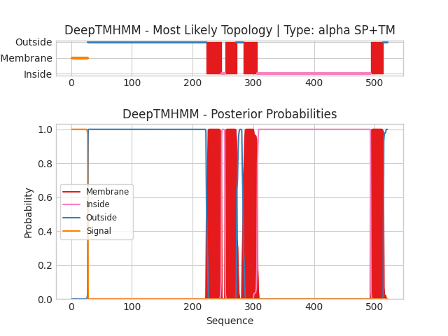

## DeepTMHMM - Predictions
Predicted topologies can be downloaded in [.gff3 format](TMRs.gff3) and [.3line format](predicted_topologies.3line)

You can download the probabilities used to generate this plot [here](uvic.3229.20.p1_probs.csv)
### Predicted Topologies
```
>uvic.3229.20.p1 | SP+TM
MRNIDLSCWSCYLLFFLSTTLPISVYGGPHERRLLNDLLAIYNNLERPVFNESEPLKLSFGLTLQQIIDVQWEDVNMRWNKSEYGGVEDIRIPPAKLWKPDVLMYNSADEAFDGTYPTNVVVSHTGSCTYIPPGIFKSTCKIDITWFPFDDQDCEMKFGSWTYNGFKLDLQTQNDEGVTSTYVLNGEWALLGVPGKRNEVFYDCCPEPYLDVTFVIKIRRRTLYYFFNLIVPCVLIASMAVLGFTLPPDSGEKLSLGVTIMLSITIFATIVGEMLPVSDATPLIGTYFNCIMFMVASSVVTTIMILNYHHRLADTHEMPNWVRCVFLQWIPWVLRMGRPGEKITRKTILMQNKMKELDLKERSSKSLLANVLDMDDDFRPASTLPHIHPHHPSHSLAGGSGTGSTANSSTKSGFRVTPGLHQPPPPPPPPPLGNSTGDVTLGDGMTSGIPPGIHRELSLILKEIRVITDKIREDEDTAAIENDWKFAAMVLDRLCLITFTMFTIIATVAVLFSAPHIIVT*
SSSSSSSSSSSSSSSSSSSSSSSSSSSOOOOOOOOOOOOOOOOOOOOOOOOOOOOOOOOOOOOOOOOOOOOOOOOOOOOOOOOOOOOOOOOOOOOOOOOOOOOOOOOOOOOOOOOOOOOOOOOOOOOOOOOOOOOOOOOOOOOOOOOOOOOOOOOOOOOOOOOOOOOOOOOOOOOOOOOOOOOOOOOOOOOOOOOOOOOOOOOOOOOOOOOOOOOOOOOOOOMMMMMMMMMMMMMMMMMMMMMMMMMIIIIIIMMMMMMMMMMMMMMMMMMMOOOOOOOOOOOMMMMMMMMMMMMMMMMMMMMMMMIIIIIIIIIIIIIIIIIIIIIIIIIIIIIIIIIIIIIIIIIIIIIIIIIIIIIIIIIIIIIIIIIIIIIIIIIIIIIIIIIIIIIIIIIIIIIIIIIIIIIIIIIIIIIIIIIIIIIIIIIIIIIIIIIIIIIIIIIIIIIIIIIIIIIIIIIIIIIIIIIIIIIIIIIIIIIIIIIIIIIIIIIIIMMMMMMMMMMMMMMMMMMMMMOOOOOOO

```


```
##gff-version 3
# uvic.3229.20.p1 Length: 521
# uvic.3229.20.p1 Number of predicted TMRs: 4
uvic.3229.20.p1	signal	1	27				
uvic.3229.20.p1	outside	28	222				
uvic.3229.20.p1	TMhelix	223	247				
uvic.3229.20.p1	inside	248	253				
uvic.3229.20.p1	TMhelix	254	272				
uvic.3229.20.p1	outside	273	283				
uvic.3229.20.p1	TMhelix	284	306				
uvic.3229.20.p1	inside	307	493				
uvic.3229.20.p1	TMhelix	494	514				
uvic.3229.20.p1	outside	515	521				

```
