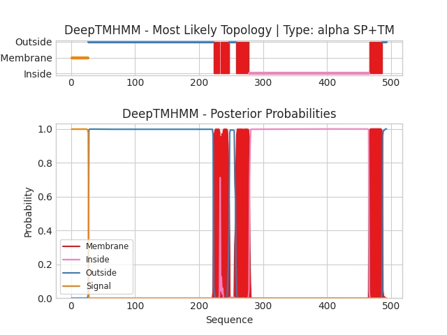

## DeepTMHMM - Predictions
Predicted topologies can be downloaded in [.gff3 format](TMRs.gff3) and [.3line format](predicted_topologies.3line)

You can download the probabilities used to generate this plot [here](uvic.3229.24.p1_probs.csv)
### Predicted Topologies
```
>uvic.3229.24.p1 | SP+TM
MRNIDLSCWSCYLLFFLSTTLPISVYGGPHERRLLNDLLAIYNNLERPVFNESEPLKLSFGLTLQQIIDVQWEDVNMRWNKSEYGGVEDIRIPPAKLWKPDVLMYNSADEAFDGTYPTNVVVSHTGSCTYIPPGIFKSTCKIDITWFPFDDQDCEMKFGSWTYNGFKLDLQTQNDEGVTSTYVLNGEWALLGVPGKRNEVFYDCCPEPYLDVTFVIKIRRRTLYYFFNLIVPCVLIASMAVLGFTLPPDSGEKLSLGTYFNCIMFMVASSVVTTIMILNYHHRLADTHEMPNWVRCVFLQWIPWVLRMGRPGEKITRKTILMQNKMKELDLKERSSKSLLANVLDMDDDFRPASTLPHIHPHHPSHSLAGGSGTGSTANSSTKSGFRVTPGLHQPPPPPPPPPLGNSTGDVTLGDGMTSGIPPGIHRELSLILKEIRVITDKIREDEDTAAIENDWKFAAMVLDRLCLITFTMFTIIATVAVLFSAPHIIVT*
SSSSSSSSSSSSSSSSSSSSSSSSSSSOOOOOOOOOOOOOOOOOOOOOOOOOOOOOOOOOOOOOOOOOOOOOOOOOOOOOOOOOOOOOOOOOOOOOOOOOOOOOOOOOOOOOOOOOOOOOOOOOOOOOOOOOOOOOOOOOOOOOOOOOOOOOOOOOOOOOOOOOOOOOOOOOOOOOOOOOOOOOOOOOOOOOOOOOOOOOOOOOOOOOOOOOOOOOOOOOOOMMMMMMMMMMIMMMMMMMMMMMMMMOOOOOOOOOOMMMMMMMMMMMMMMMMMMMMMIIIIIIIIIIIIIIIIIIIIIIIIIIIIIIIIIIIIIIIIIIIIIIIIIIIIIIIIIIIIIIIIIIIIIIIIIIIIIIIIIIIIIIIIIIIIIIIIIIIIIIIIIIIIIIIIIIIIIIIIIIIIIIIIIIIIIIIIIIIIIIIIIIIIIIIIIIIIIIIIIIIIIIIIIIIIIIIIIIIIIIIIIIIMMMMMMMMMMMMMMMMMMMMMOOOOOOO

```


```
##gff-version 3
# uvic.3229.24.p1 Length: 493
# uvic.3229.24.p1 Number of predicted TMRs: 4
uvic.3229.24.p1	signal	1	27				
uvic.3229.24.p1	outside	28	222				
uvic.3229.24.p1	TMhelix	223	232				
uvic.3229.24.p1	inside	233	233				
uvic.3229.24.p1	TMhelix	234	247				
uvic.3229.24.p1	outside	248	257				
uvic.3229.24.p1	TMhelix	258	278				
uvic.3229.24.p1	inside	279	465				
uvic.3229.24.p1	TMhelix	466	486				
uvic.3229.24.p1	outside	487	493				

```
