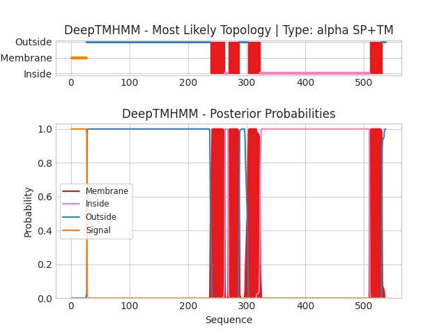

## DeepTMHMM - Predictions
Predicted topologies can be downloaded in [.gff3 format](TMRs.gff3) and [.3line format](predicted_topologies.3line)

You can download the probabilities used to generate this plot [here](uvic.3229.3.p1_probs.csv)
### Predicted Topologies
```
>uvic.3229.3.p1 | SP+TM
MRNIDLSCWSCYLLFFLSTTLPISVYGGPHERRLLNDLLAIYNNLERPVFNESEPLKLSFGLTLQQIIDVDEKNQLLTTNVWLNLQWEDVNMRWNKSEYGGVEDIRIPPAKLWKPDVLMYNSADEAFDGTYPTNVVVSHTGSCTYIPPGIFKSTCKIDITWFPFDDQDCEMKFGSWTYNGFKLDLQTQNDEGVTSTYVLNGEWALLGVPGKRNEVFYDCCPEPYLDVTFVIKIRRRTLYYFFNLIVPCVLIASMAVLGFTLPPDSGEKLSLGVTVLLSLTVFQQNVSEAMPVTSLQVPLLGTYFNCIMFMVASSVVTTIMILNYHHRLADTHEMPNWVRCVFLQWIPWVLRMGRPGEKITRKTILMQNKMKELDLKERSSKSLLANVLDMDDDFRPASTLPHIHPHHPSHSLAGGSGTGSTANSSTKSGFRVTPGLHQPPPPPPPPPLGNSTGDVTLGDGMTSGIPPGIHRELSLILKEIRVITDKIREDEDTAAIENDWKFAAMVLDRLCLITFTMFTIIATVAVLFSAPHIIVT*
SSSSSSSSSSSSSSSSSSSSSSSSSSSOOOOOOOOOOOOOOOOOOOOOOOOOOOOOOOOOOOOOOOOOOOOOOOOOOOOOOOOOOOOOOOOOOOOOOOOOOOOOOOOOOOOOOOOOOOOOOOOOOOOOOOOOOOOOOOOOOOOOOOOOOOOOOOOOOOOOOOOOOOOOOOOOOOOOOOOOOOOOOOOOOOOOOOOOOOOOOOOOOOOOOOOOOOOOOOOOOOOOOOOOOOOOOOOOOMMMMMMMMMMMMMMMMMMMMMMMMMIIIIIIMMMMMMMMMMMMMMMMMMMOOOOOOOOOOOOOOMMMMMMMMMMMMMMMMMMMMMIIIIIIIIIIIIIIIIIIIIIIIIIIIIIIIIIIIIIIIIIIIIIIIIIIIIIIIIIIIIIIIIIIIIIIIIIIIIIIIIIIIIIIIIIIIIIIIIIIIIIIIIIIIIIIIIIIIIIIIIIIIIIIIIIIIIIIIIIIIIIIIIIIIIIIIIIIIIIIIIIIIIIIIIIIIIIIIIIIIIIIIIIIIMMMMMMMMMMMMMMMMMMMMMOOOOOOO

```


```
##gff-version 3
# uvic.3229.3.p1 Length: 537
# uvic.3229.3.p1 Number of predicted TMRs: 4
uvic.3229.3.p1	signal	1	27				
uvic.3229.3.p1	outside	28	237				
uvic.3229.3.p1	TMhelix	238	262				
uvic.3229.3.p1	inside	263	268				
uvic.3229.3.p1	TMhelix	269	287				
uvic.3229.3.p1	outside	288	301				
uvic.3229.3.p1	TMhelix	302	322				
uvic.3229.3.p1	inside	323	509				
uvic.3229.3.p1	TMhelix	510	530				
uvic.3229.3.p1	outside	531	537				

```
