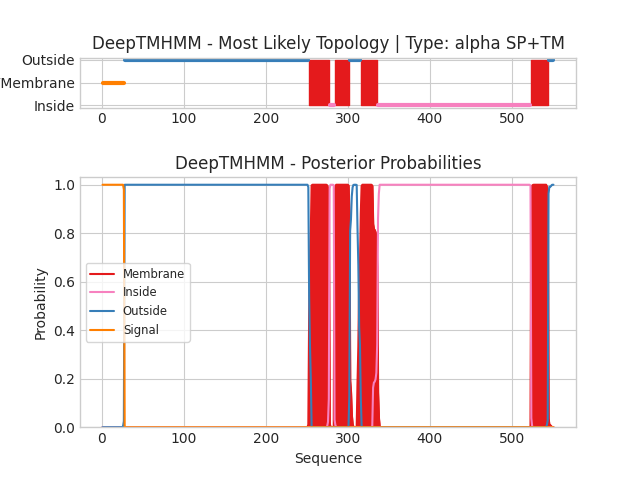

## DeepTMHMM - Predictions
Predicted topologies can be downloaded in [.gff3 format](TMRs.gff3) and [.3line format](predicted_topologies.3line)

You can download the probabilities used to generate this plot [here](uvic.3229.8.p1_probs.csv)
### Predicted Topologies
```
>uvic.3229.8.p1 | SP+TM
MRNIDLSCWSCYLLFFLSTTLPISVYGGPHERRLLNDLLAIYNNLERPVFNESEPLKLSFGLTLQQIIDVDEKNQILTTNIWLNLDEKNQLLTTNVWLNLQWEDVNMRWNKSEYGGVEDIRIPPAKLWKPDVLMYNSADEAFDGTYPTNVVVSHTGSCTYIPPGIFKSTCKIDITWFPFDDQDCEMKFGSWTYNGFKLDLQTQNDEGVTSTYVLNGEWALLGVPGKRNEVFYDCCPEPYLDVTFVIKIRRRTLYYFFNLIVPCVLIASMAVLGFTLPPDSGEKLSLGVTIMLSITIFATIVGEMLPVSDATPLIGTYFNCIMFMVASSVVTTIMILNYHHRLADTHEMPNWVRCVFLQWIPWVLRMGRPGEKITRKTILMQNKMKELDLKERSSKSLLANVLDMDDDFRPASTLPHIHPHHPSHSLAGGSGTGSTANSSTKSGFRVTPGLHQPPPPPPPPPLGNSTGDVTLGDGMTSGIPPGIHRELSLILKEIRVITDKIREDEDTAAIENDWKFAAMVLDRLCLITFTMFTIIATVAVLFSAPHIIVT*
SSSSSSSSSSSSSSSSSSSSSSSSSSSOOOOOOOOOOOOOOOOOOOOOOOOOOOOOOOOOOOOOOOOOOOOOOOOOOOOOOOOOOOOOOOOOOOOOOOOOOOOOOOOOOOOOOOOOOOOOOOOOOOOOOOOOOOOOOOOOOOOOOOOOOOOOOOOOOOOOOOOOOOOOOOOOOOOOOOOOOOOOOOOOOOOOOOOOOOOOOOOOOOOOOOOOOOOOOOOOOOOOOOOOOOOOOOOOOOOOOOOOOOOOOOOOMMMMMMMMMMMMMMMMMMMMMMMMMIIIIIIMMMMMMMMMMMMMMMMMMMOOOOOOOOOOOOOMMMMMMMMMMMMMMMMMMMMMIIIIIIIIIIIIIIIIIIIIIIIIIIIIIIIIIIIIIIIIIIIIIIIIIIIIIIIIIIIIIIIIIIIIIIIIIIIIIIIIIIIIIIIIIIIIIIIIIIIIIIIIIIIIIIIIIIIIIIIIIIIIIIIIIIIIIIIIIIIIIIIIIIIIIIIIIIIIIIIIIIIIIIIIIIIIIIIIIIIIIIIIIIIMMMMMMMMMMMMMMMMMMMMMOOOOOOO

```


```
##gff-version 3
# uvic.3229.8.p1 Length: 551
# uvic.3229.8.p1 Number of predicted TMRs: 4
uvic.3229.8.p1	signal	1	27				
uvic.3229.8.p1	outside	28	252				
uvic.3229.8.p1	TMhelix	253	277				
uvic.3229.8.p1	inside	278	283				
uvic.3229.8.p1	TMhelix	284	302				
uvic.3229.8.p1	outside	303	315				
uvic.3229.8.p1	TMhelix	316	336				
uvic.3229.8.p1	inside	337	523				
uvic.3229.8.p1	TMhelix	524	544				
uvic.3229.8.p1	outside	545	551				

```
